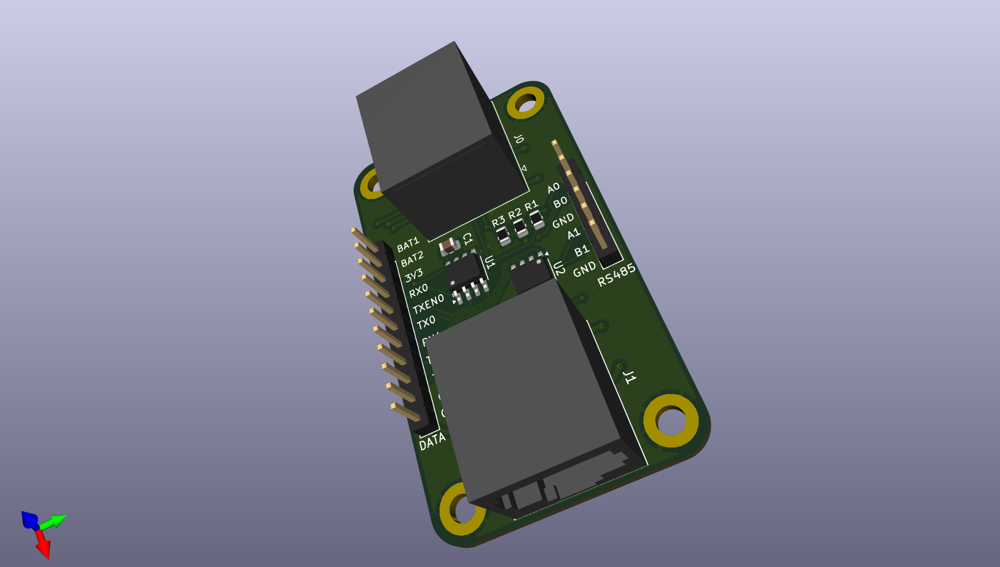
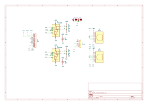

# RS485 Breakout Board

* Includes 2 half-duplex RS485 interfaces
* Allows using CAT6 patch cables w/6 wires carrying power and one pair for communication
* Termination resistors were chosen to match 100ohm impedence of Cat5/6 Ethernet cables

[Schematic pdf](v1.0.RS485_breakout.pdf)

